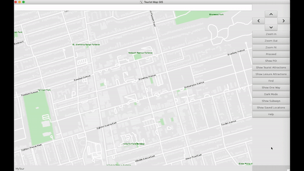

# MyTour
MyTour is a geographic information system (GIS) written in C++ capable of displaying major cities and designed to help tourists using data from OpenStreetMaps. It's features include:

* An interactive user interface (pan, zoom, highlight, search for locations, etc.)
* Displayable points of interests (Restaurant's, tourist attractions, parks)
* Finding the shortest path between two intersections using A* algorithm optional driving instructions to get there
* Map simplification at zoomed out levels to increase performance and usability

## Demo of MyTour

### Zooming and Moving the Map
Users can zoom and move the map. More details are shown at higher zoom levels (small streets, building silouhettes, etc) to improve performance and usability.  

### Dark Mode
For night time driver's, dark mode can be toggled on at any moment

### Displaying Features
Simple to use menu to filter and display information to the tourist's needs  

#### Points of Interest  

#### Subway Infomation    

### Navigation
Streets and intersections can be found using the search bar. Furthermore, the shortest route between two points can also be calculated as well as driving instructions to reach it. The starting and ending points can be entered using either the search bar or by simply clicking on the map.

#### Finding a street  

#### Finding Points of Interest

#### Find paths by clicking

#### Find paths by searching

